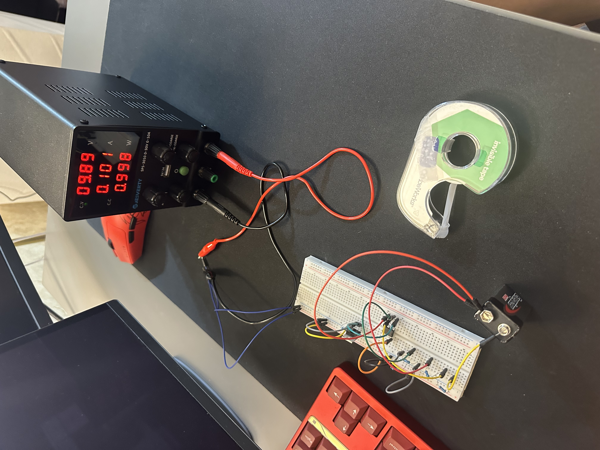

# Op-Amp Over-Voltage Protection Circuit

**Type:** Analog Hardware Project  
**Tools:** LTspice, Breadboard, Multimeter  

---

## Project Overview
Designed and built an analog over-voltage protection circuit that disconnects a load when input voltage exceeds a defined threshold.  
Simulated in LTspice and verified on physical hardware.

---

## Problem Statement
Voltage spikes can damage sensitive electronic loads.  
This circuit provides automatic hardware protection without requiring a microcontroller.

---

## Theoretical Analysis
The trip voltage is determined by a voltage divider scaling the input voltage to match the reference voltage.

$$
V_{scaled} = V_{in} \cdot \frac{R_2}{R_1 + R_2}
$$

Setting $V_{scaled} = V_{ref}$:

$$
V_{trip} = V_{ref} \cdot \left(1 + \frac{R_1}{R_2}\right)
= 4.5V \cdot (1 + 1) = 9V
$$

---

## Verification Results

| Parameter | Theoretical | LTspice | Hardware |
|----------|------------|---------|----------|
| Trip Voltage ($V_{trip}$) | 9.00V | 9.02V | ~9.1V |
| Reference Voltage ($V_{ref}$) | 4.50V | 4.50V | 4.48V |
| Load Status ($V_{in} > 9V$) | OFF | OFF | OFF |

---

## Simulation
- Verified comparator switching behavior in LTspice  
- Observed output transition at ~9V threshold  
- Confirmed expected behavior prior to hardware build  

---

## Hardware Implementation

### Breadboard Setup

---

## Engineering Insights (Debugging & Non-Idealities)
- Breadboard parasitic capacitance (~1–5 pF) introduced minor noise near switching threshold  
- LM358 input offset voltage (~2 mV) caused slight deviation from ideal trip point  
- Real hardware showed small variation compared to simulation (~0.1V difference)  
- Reinforced importance of component tolerances and non-ideal effects  

---

## Key Learnings
- Comparator-based protection circuit design  
- Voltage divider threshold calculation  
- MOSFET switching behavior  
- Differences between simulation and real hardware  
- Importance of grounding in multi-supply systems  

---

## Files
- circuit-schematic.asc — LTspice simulation  
- breadboard-setup.jpeg — hardware implementation  

---

